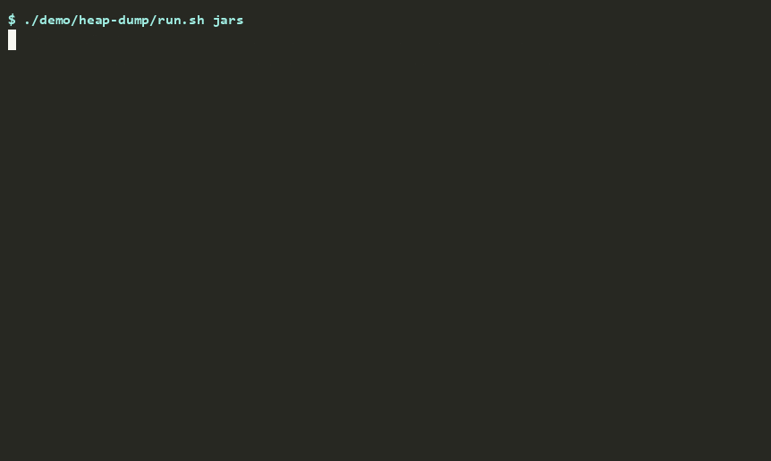

# seclume

**Java heap dumps without database credentials.**

Every heap dump of a Java application that talks to a database contains the database
password: `jmap`, `-XX:+HeapDumpOnOutOfMemoryError`, the Actuator's `/heapdump`, the file
attached to a support ticket. It does not matter that the password came from Vault. The
moment the client library turns Vault's answer into a `String`, and the JDBC driver keeps it,
it is on the heap, and the heap is what gets dumped.

seclume is a set of JDBC drivers (PostgreSQL, MySQL/MariaDB, SQL Server, Oracle) built so that
this does not happen:

```
            the usual stack                          seclume

  Vault                                    Vault
    |                                        |
    v                                        v
  password -> java.lang.String             native memory (locked, wiped after use)
    |                                        |
    v                                        v
  JDBC driver                              seclume JDBC driver
    |                                        |
    v                                        v
  heap dump  ->  FOUND: the password       heap dump  ->  NOT FOUND
```

**Don't take our word for it. Check it.** [`demo/heap-dump`](demo/heap-dump) runs the same
small application twice against PostgreSQL and a Vault dev server, once with pgjdbc and
once with seclume, dumps both heaps and searches them. This is its output, unedited:



As text:

```
== pgjdbc - the password from Vault as a String
  database password:
    FOUND - the secret is in the heap of process 26, 2 time(s):
      raw file: UTF-8 match of 31 bytes at 8175627
      byte[] 30308835136: UTF-8 match of 31 bytes at 132
  Vault token:
    FOUND - the secret is in the heap of process 26, 2 time(s):
      raw file: UTF-8 match of 31 bytes at 8179605
      byte[] 30308837096: UTF-8 match of 31 bytes at 0

== seclume - the password from Vault into native memory
  database password:
    NOT FOUND - the secret from /shared/db-password is not in the heap of process 46.
  Vault token:
    NOT FOUND - the secret from /shared/vault-token is not in the heap of process 46.
```

And for **your own application**, whatever driver it uses:

```
java -jar seclume-heapcheck.jar --pid <pid> --secret-file /run/secrets/db-password
```

It attaches to the running JVM, takes a dump, searches it for the secret in every encoding it
could be in, and deletes the dump again. The secret comes from a file, never from the command
line.

### How

A database password never becomes a `String`, a `char[]` or a `byte[]`. It goes from its source
(a file, Vault, a cloud secret manager, a managed identity) into native memory, is used there
for the login, and is wiped. All four wire protocols are written from scratch for this; no
vendor driver is used, wrapped or delegated to. The test suite holds the same line by taking
real heap dumps and searching them, with a negative control that must fail.

Beyond that it is a complete driver set for everyday use: a pool, a Spring Boot starter,
TLS 1.3 by default, and Kerberos and OAuth logins with no secret in the process at all. It is
measured against the vendor drivers with the same settings on both sides, including the rows
where it is behind ([Speed](#speed)). See [Features at a glance](#features-at-a-glance).

Java 25, Spring Boot 4.x / Spring Framework 7.x. No runtime dependency beyond the JDK.

**Contents:** [Quick start](#quick-start) · [What you get without configuring anything](#what-you-get-without-configuring-anything) ·
[Features at a glance](#features-at-a-glance) · [Not yet](#what-it-does-not-do-yet) ·
[Speed](#speed) · [Building](#building-and-testing) · [Support](#support-and-what-you-may-rely-on)

---

## Quick start

```xml
<dependency>
  <groupId>space.seclume</groupId>
  <artifactId>seclume-spring-boot-starter</artifactId>
  <version>0.9.0</version>
</dependency>
<dependency>
  <groupId>space.seclume</groupId>
  <artifactId>seclume-postgresql</artifactId>   <!-- or -mysql, -sqlserver, -oracle -->
  <version>0.9.0</version>
</dependency>
```

```properties
seclume.datasources.main.url=jdbc:seclume:postgresql://db:5432/app?tls=verify-full
seclume.datasources.main.username=app
seclume.datasources.main.secret-uri=file:/run/secrets/db-password
```

That is the whole integration. Spring gets a pooled `DataSource`, and Spring Data, Hibernate
and Flyway work on it as they would on any other.

Without Spring, the same thing as a URL:

```java
String url = "jdbc:seclume:postgresql://db:5432/app"
           + "?user=app&provider=file&path=/run/secrets/db-password";
try (Connection c = DriverManager.getConnection(url)) {
    // plain JDBC from here
}
```

The URL prefix is `jdbc:seclume:`. There is one artifact per database: `seclume-postgresql`,
`seclume-mysql`, `seclume-sqlserver` and `seclume-oracle`. There are also `seclume-pool` and
`seclume-spring-boot-starter`, and the starter pulls in what it needs. The groupId and the
package root are the same, `space.seclume`.

**Coming from HikariCP, pgjdbc, Connector/J, mssql-jdbc or ojdbc?**
`java -jar seclume-verify.jar --migrate application.properties` translates your configuration,
and **[MIGRATING.md](MIGRATING.md)** lists the errors that stop happening, each with the test
that shows it.

**Where the secret comes from** is a provider, never a value. A secret is never a setting,
and `password=` is refused. The providers are `file`, `env-file`, `process`, `unix-socket`,
`dpapi`, `credential-manager`, `encrypted`, `rds-iam`, `vault` (including dynamic database
credentials), `aws-secrets-manager`, `azure-key-vault`, `gcp-secret-manager`,
`azure-managed-identity`, `gcp-metadata`, `none` (the client certificate is the login), and
`callback` for your own code. **[PROVIDERS.md](PROVIDERS.md)** has every setting of every
provider and says which one to pick.

---

## What you get without configuring anything

The quick start above already gives you:

- **No password on the heap**, in a page that is locked against swapping, left out of crash
  dumps, and wiped after use.
- **Expiring credentials handled by the pool.** A Vault lease or an RDS token is replaced
  before it runs out, so nothing fails an hour later.
- **A clean connection for every borrower.** A `SET app.tenant_id`, a temporary table or a
  `LISTEN` from one request does not reach the next one.
- **Statements a borrower forgot are closed** on return, and logged with where they came
  from.
- **A shutdown that lets running transactions finish.** On SIGTERM, borrowed connections get
  up to 10 s to come back before anything is cut.
- **A result limit.** A runaway query fails on its own instead of taking the heap with it.
- **Idle connections that stay alive**, below the server's own idle limit (`wait_timeout`,
  `idle_session_timeout`) and through firewalls. If something cuts one anyway, the error
  names the cause.
- **A warning when the pool could exhaust the server's connection limit**, before the
  scale-out that would find out.
- **A startup report of plaintext passwords elsewhere** in the Spring configuration, naming
  the properties and never the values.

What is left to decide is `tls=`: whether to authenticate the server
([TLS.md](TLS.md)).

---

## Features at a glance

Everything below works on all four databases unless the row says otherwise.

| Area | What | More |
|---|---|---|
| **Secrets** | 14 providers plus `none` and `callback`: files, Windows DPAPI/Credential Manager, Vault, AWS/Azure/GCP vaults, RDS IAM, workload identity | [PROVIDERS.md](PROVIDERS.md) |
| | Dynamic credentials: the pool rotates connections before the lease ends, without emptying | [PROVIDERS.md](PROVIDERS.md#what-expires-buys) |
| | Secret columns read and bound off the heap (`Sensitive`, `SensitiveParameters`) | [FEATURES.md](FEATURES.md#secrets-in-columns-not-only-in-the-login) |
| **TLS** | `verify-full`, a per-connection CA file (`tlsRootCert`) or a key pin (`tlsPin`) | [TLS.md](TLS.md) |
| | Own TLS 1.3 stack: traffic secrets never become Java objects; post-quantum X25519MLKEM768 with OpenSSL 3.5 | [TLS.md](TLS.md#which-tls-carries-it-a-separate-question) |
| | Client certificates with the key off the heap, in the Windows store or in a TPM | [TLS.md](TLS.md#mutual-tls-with-the-client-key-off-the-heap-too) |
| | SQL Server strict encryption (TDS 8.0), PostgreSQL 17 direct TLS | [TLS.md](TLS.md) |
| **JDBC** | The full surface: callable statements, named parameters, generated keys, batches, LOBs, scrollable results, XA | [FEATURES.md](FEATURES.md#the-jdbc-surface-on-all-four) |
| | Cancellation and timeouts that stop the statement on the server | [FEATURES.md](FEATURES.md#the-jdbc-surface-on-all-four) |
| | `where id in (?)` with a whole list: one plan, no 1000/2100 limit | [FEATURES.md](FEATURES.md#writing-retrying-and-not-guessing) |
| | SQL Server: `varchar` parameters where the column is `varchar`, so the index is used; bulk load (`INSERT BULK`); table-valued parameters | [FEATURES.md](FEATURES.md#sql-server-only) |
| | `Pipeline`: a unit of work in one round trip | [FEATURES.md](FEATURES.md#writing-retrying-and-not-guessing) |
| | `Retry` for serialization failures and deadlocks; a lost commit reported as unknown, never retried | [FEATURES.md](FEATURES.md#writing-retrying-and-not-guessing) |
| | PostgreSQL: arrays, XML, large objects, LISTEN/NOTIFY, `COPY` bulk import/export, PgBouncer; CockroachDB, YugabyteDB | [FEATURES.md](FEATURES.md#postgresql-only) |
| **Pool** | No dependency, virtual threads, statement cache, leak detection | [FEATURES.md](FEATURES.md#the-pool) |
| | Session reset on return (the tenant leak), open statements closed | [FEATURES.md](FEATURES.md#the-pool) |
| | The tenant set on every borrow for row-level security (`SessionContext`) | [FEATURES.md](FEATURES.md#the-pool) |
| **Clusters** | Host lists, `targetServerType=primary`, `hostSelection=quality` | [FEATURES.md](FEATURES.md#several-servers-and-which-one-to-take) |
| | Read replicas with `ReadWriteSplit`, read-your-writes on PostgreSQL | [FEATURES.md](FEATURES.md#several-servers-and-which-one-to-take) |
| **Frameworks** | Spring Data JPA, Hibernate, Flyway, Liquibase, jOOQ, MyBatis, Spring Data JDBC, all tested on all four | [FRAMEWORKS.md](FRAMEWORKS.md) |
| | Testcontainers `@ServiceConnection` and Docker Compose: the pool comes from the container | [FEATURES.md](FEATURES.md#spring-data-and-jpa) |
| **Observability** | JFR events, Micrometer meters, OpenTelemetry spans, all without values | [OBSERVABILITY.md](OBSERVABILITY.md) |
| | `/actuator/seclume`: login method, TLS, certificate expiry and server capacity per data source | [OBSERVABILITY.md](OBSERVABILITY.md#actuatorseclume-how-every-data-source-is-secured) |
| | N+1 detection (`QueryStorms`), the last messages before a break (`Flight`) | [OBSERVABILITY.md](OBSERVABILITY.md#diagnostics-for-specific-defects) |
| **Tools** | `seclume-verify`: a one-shot connection report, for a ticket or a readiness probe | [OBSERVABILITY.md](OBSERVABILITY.md#seclume-verify) |
| | `seclume-verify --migrate`: your Hikari/pgjdbc/mssql-jdbc configuration translated, unsafe settings named | [OBSERVABILITY.md](OBSERVABILITY.md#seclume-verify) |
| | `NoSecretInHeap`: the heap-dump proof in your own tests; `seclume-heapcheck` for any process |
| **Your own library** | `seclume-core`'s secret classes for any client that holds a secret: mail, API keys, signing keys | [SECRETS-API.md](SECRETS-API.md) | [FEATURES.md](FEATURES.md#proving-there-is-no-secret-on-the-heap-for-any-application) |
| **Kafka** | SASL/SCRAM (SHA-256, SHA-512) with the password off the heap: `seclume-kafka` | [FEATURES.md](FEATURES.md#kafka) |
| **Redis** | Jedis logged in from native memory, over TLS 1.3 with keys off the heap: `seclume-redis` | [FEATURES.md](FEATURES.md#redis) |
| **Runtime** | GraalVM native image, no flags needed | [FEATURES.md](FEATURES.md#graalvm-native-image) |
| | Quarkus, JVM and native: the four drivers as datasource kinds; a password in the configuration fails the build | [FEATURES.md](FEATURES.md#quarkus) |
| | CRaC / Lambda SnapStart with `seclume-crac`: the checkpoint image holds no password | [FEATURES.md](FEATURES.md#the-pool) |

What each server version reports is in [COMPATIBILITY.md](COMPATIBILITY.md), generated by
connecting to it. The full history is in [CHANGELOG.md](CHANGELOG.md).

---

## What it protects, and what it does not

seclume makes one artefact safe: **the heap dump**. Heap dumps are taken routinely, by
`-XX:+HeapDumpOnOutOfMemoryError`, by an Actuator endpoint left open, by a support engineer.
They are copied to buckets, tickets and laptops. Today they carry the database password
wherever they go. With seclume they do not carry the password, and they do not carry a
token, a Vault token read by a seclume provider, or a client certificate's private key either.

It does **not** make the process a vault:

- **Your data is still on the heap.** Rows you read and parameters you bind are Java objects,
  as with any driver. Columns that hold secrets can be read and bound off the heap
  (`Sensitive`, `SensitiveParameters`), but that is opt-in, per column.
- **With the default TLS (JSSE), the session keys are on the heap.** Only `tlsStack=seclume`
  keeps the traffic secrets out of it, and that stack is newer and has had less scrutiny than
  JSSE. See [TLS.md](TLS.md#which-tls-carries-it-a-separate-question).
- **Other secrets in your application are yours.** An API key in `application.yml` is on the
  heap whatever driver you use. The starter warns about plaintext passwords it can see, and
  `seclume-heapcheck` finds any secret you name in a running process.
- **Someone who can read the process's memory, or the secret's source, has the secret.**
  Root, `ptrace` or `/proc/<pid>/mem` read native memory as well. Someone who can read
  `/run/secrets/db` or the Vault token does not need a dump. seclume closes the leak through
  the dump, not a compromised host.

Where you can, log in **without a secret at all**: Kerberos (PostgreSQL, MariaDB, SQL Server), short-lived
IAM or Entra tokens, or PostgreSQL 18 OAuth. seclume supports those too. And lock down the
heap-dump endpoints anyway.

## What it does not do yet

- **Integrated authentication on Windows, and for Oracle.** Kerberos works for PostgreSQL,
  MariaDB (`auth_gssapi`) and SQL Server (`authentication=kerberos`, against Active Directory)
  through the system's GSSAPI library on Linux: a ticket from `kinit` or a keytab, and no
  secret in the process at all. Windows' SSPI and Oracle's Kerberos/NTS are refused with a
  message saying so. Oracle's goes through the same undocumented negotiation as its native
  encryption.
- **Moving a live session from one host to another.** It is being built, but not here. The
  drivers hold their own protocol and TLS state, which is exactly what such a move needs and
  what no driver built on an `SSLEngine` can offer. So this repository carries the seams it
  takes: a logged-in stream can be handed over (`detach`), described while it stays open
  (`snapshot`), and picked up again (`resume`). What happens between those ends is developed
  separately and is not part of this distribution. When it is finished, what will be
  published here is the **evidence**, not the code.

---

## Speed

The aim is not "fast enough" but faster than the established Java drivers. The recorded rows
come from JMH runs, written to [BENCHMARKS.md](BENCHMARKS.md) together with the machine,
the JDK, the server and every iteration. That run used a quiet Linux host with 4 cores, the
benchmark pinned to two of them, and MySQL on the same machine, so it shows what the driver
costs rather than what the network does.

| Measurement | seclume | vendor driver | recorded |
|---|---|---|---|
| batch of 500 rows, both drivers as they come | **17.9 ms** ± 0.3 | 29.1 ms ± 0.4 (Connector/J) | [yes](BENCHMARKS.md#batches-with-fair-settings-25092026-two-runs) |
| batch of 500 rows, both rewriting it into multi-row inserts | about 5 or about 12 ms | the same | [yes](BENCHMARKS.md#batches-with-fair-settings-25092026-two-runs) |
| 1000 rows in one query | **0.73 ms** ± 0.02 | 0.91 ms ± 0.01 (Connector/J) | [yes](BENCHMARKS.md) |
| one row | **42.2 µs** ± 0.9 | 45.1 µs ± 0.7 (Connector/J) | [yes](BENCHMARKS.md) |
| `select 1` | 42.1 µs ± 0.5 | **41.4 µs** ± 1.0 (Connector/J) | [yes](BENCHMARKS.md) |
| pool: borrow and return, nothing else | 0.54 µs ± 0.01 | **0.52 µs** ± 0.04 (HikariCP) | [yes](BENCHMARKS.md) |
| pool: borrow, query, return | **124.6 µs** ± 12.5 | 125.5 µs ± 10.6 (HikariCP + Connector/J) | [yes](BENCHMARKS.md) |

**How to read the batch rows.** Connector/J sends a batch row by row unless
`rewriteBatchedStatements=true` is set, and seclume pipelines the rows. That is the first
row, and it compares defaults. With both drivers told to rewrite a batch into multi-row
inserts (seclume: `rewriteBatchedInserts=true`), **neither is ahead**. Every fork of either
driver ran at about 5 or about 12 ms, a split that comes from the server, not the driver. An
earlier version of this table compared seclume against Connector/J's default alone. That
flattered seclume, and an outside review said so.

Only rows recorded in BENCHMARKS.md are shown here. Figures measured without a recorded run
(over a LAN, with PostgreSQL and eight threads, or counted in round trips) were removed until
they are recorded. **The rows where the vendor side is ahead are left in deliberately.** A
table that only listed the wins would be advertising.

To reproduce a run:

```
java -Dbench.db=mysql -Dbench.host=<host> -Dbench.port=3306 -Dbench.database=seclume_test -Dbench.user=seclume_test -Dbench.password.file=.local-mysql-password -jar seclume-bench/target/seclume-bench.jar QueryBenchmark -rf json -rff jmh.json
```

---

## Building and testing

```
./mvnw clean test
```

Everything that needs no database runs; everything that needs one skips itself and says why.
`-Papicheck verify` compares the public API with the last release, and `-Prelease package`
writes a CycloneDX SBOM per module (`seclume-core` lists no runtime dependency at all).
[TESTING.md](TESTING.md) explains how to bring the four databases up and how to point the
tests at servers elsewhere. On every push, CI runs the same suite against PostgreSQL 15 and
18, MySQL 8.4, MariaDB 11.4, SQL Server 2022, Oracle Free 23ai, CockroachDB 24.1 and
YugabyteDB 2024.1. The four wire parsers are fuzzed: a sample runs in every build, and the
whole corpus runs nightly.

## Where the protocol knowledge came from

Three of the four protocols have published specifications and were implemented from them.
The fourth, Oracle, has none. The largest single source there is Oracle's own driver, under a
licence that permits reimplementation. No vendor source was used, no headers, and nothing was
decompiled: [PROVENANCE.md](PROVENANCE.md).

## Rules of honesty

- No placeholder that pretends to work. What is not implemented throws.
- No provisional delegation to a vendor driver, not even commented out.
- A protocol detail that cannot be established with certainty counts as unsupported rather
  than being guessed.
- Test results are reported with their output. "Should work" does not count.

## Support, and what you may rely on

seclume is written and maintained by one person, in the time that person has. It is used in
earnest, it is kept working, and issues do get read. But there is **no company behind it, no
support contract, and no promise that anything is answered within any particular time, or at
all**. Nor is there a promise of a next release. Please plan as though the version you are
using now is the last one you will get. If a later one arrives, treat it as a gift rather than
as the plan.

That matters more than usual here, because this is a **driver**, the piece everything else
sits on. So it is built to be survivable without its author:

- The **licence is Apache-2.0**, so you may keep using, patching and shipping what is here,
  whatever happens to this project.
- **Nothing is hidden.** Every byte on the wire is written in this repository. There is no
  vendor driver underneath to fall back to and no service to call home to.
- The **tests are the specification**, and they run against real PostgreSQL, MySQL, MariaDB,
  SQL Server and Oracle servers. They are the thing to read first if you ever have to take
  this over, and the reason you could.
- **Security reports** are taken seriously and handled as fast as one person can, which is
  not the same as an SLA.

If seclume matters to something you are paid to keep running, budget for owning it rather than
for being supported. That is the honest arrangement, and saying so up front seems better than
letting anyone find out at the wrong moment.

## Licence

Apache License 2.0; see [LICENSE](LICENSE) and [NOTICE](NOTICE). You may use it commercially,
modify it, and ship it inside a closed product. The licence grants the patent rights along
with the copyright ones, which for a project full of protocol implementations is the part that
matters.

The transport that moves a live session between hosts is **not** part of this repository, is
not covered by that licence, and no rights to it are granted here.
